# Health Connect Mirror Sample

## Architecture

This document will describe how to configure mirror for a new deployment of Health Connect and how mirrored namespaces should be created.
The architecture includes a ha_proxy deployment working as a load balancer, 2 web gateways that are mirror aware, 1 mirror pair and a dedicated web gateway for each node and the arbiter.  _For the sake of easy reproducibility, this guide uses a container deployment. However, with exception of specific docker commands, everything should work for different types of deployments._

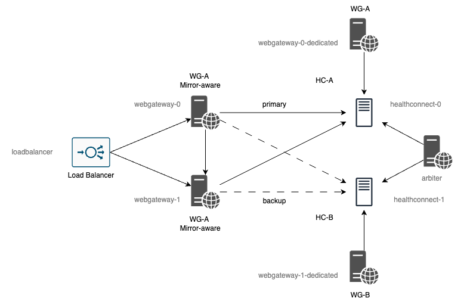

_Note that this document will not provide steps to installing Health Connect._

## Constraints for Using the Containers

To fully execute this tutorial in containers:

- You must have a valid Health Connect container license key. Once you have the license, copy the file to `./license/iris/<architecture>/` saved as `iris.key`
  - [./license/iris/amd64/*](license/iris/amd64/) (example: ./license/iris/amd64/iris.key)
  - [./license/iris/arm64/*](license/iris/arm64/) (example: ./license/iris/arm64/iris.key)
- You must have access to [containers.intersystems.com](http://containers.interystems.com/), simply log with your InterSystems credentials and copy & paste the _Docker login command_ into the terminal.

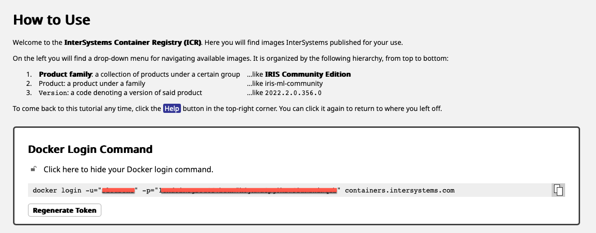

Otherwise you can follow the steps on your local deployment.

## Running the Container

To run the container using **docker compose**, first make sure to clone the repo, then execute below from the project root directory:

```bash
# for x64 architecture
docker compose up -d    # to start the container detached
docker compose down -v  # to stop and remove the container

# for arm64 architecture
docker compose --env-file=.env-arm64 up -d    # to start the container detached
docker compose --env-file=.env-arm64 down -v  # to stop and remove the container
```

## Local Access Shortcuts

When you environments are running, you can access it from the links below:

- **[SMP - primary (load balanced)](http://localhost:8080/csp/sys/%25CSP.Portal.Home.zen)** - <http://localhost:8080/csp/sys/%25CSP.Portal.Home.zen>
- **[SMP - healthconnect-0 (dedicated)](http://localhost:8082/csp/sys/%25CSP.Portal.Home.zen)** - <http://localhost:8082/csp/sys/%25CSP.Portal.Home.zen>
- **[SMP - healthconnect-1 (dedicated)](http://localhost:8084/csp/sys/%25CSP.Portal.Home.zen)** - <http://localhost:8084/csp/sys/%25CSP.Portal.Home.zen>
- **Username:** SuperUser
- **Password:** SYS

## Mirror Configuration

This section follows the [Configuring Mirroring](https://docs.intersystems.com/healthconnectlatest/csp/docbook/DocBook.UI.Page.cls?KEY=GHA_mirror_set_config) documentation.

### Mirror Aware Web Gateway

The mirror aware configuration is done via the CSP.ini parameter **Mirror_Aware** and can be found in [CSP-000.ini](webgateway/CSP-000.ini) and [CSP-001.ini](webgateway/CSP-001.ini):

```bash
[REMOTE]
Ip_Address=healthconnect-0
TCP_Port=1972
Username=SuperUser
Minimum_Server_Connections=3
Maximum_Session_Connections=3
Password=]]]U1lT
Mirror_Aware=1
```

### Mirror Through CPF Merge

There are different techniques that allow automatic mirror configuration at the instance level by leveraging the configuration merge (CPF merge). In this example we [Deploy the Mirror Using Hostname Matching](https://docs.intersystems.com/healthconnectlatest/csp/docbook/DocBook.UI.Page.cls?KEY=ACMF#ACMF_iris_customizing_useful_mirror_hostnames).

Looking at the architecture, we have two Health Connect instances:

- healthconnect-0
- healthconnect-1

The [merge-mirror.cpf](scripts/merge-mirror.cpf) contains a line that can leverage the naming convention and automatically deploy mirror. The same CPF merge is applied to both instances and they get configured following the behavior described in the documentation with a mirror set named **HEALTHCONNECT**. In addition to that, another line to enable ECP is also part of the file.

```text
ConfigMirror:Name=HEALTHCONNECT,Map="primary,backup",Member=auto,Primary=auto,ArbiterURL=arbiter:2188
```

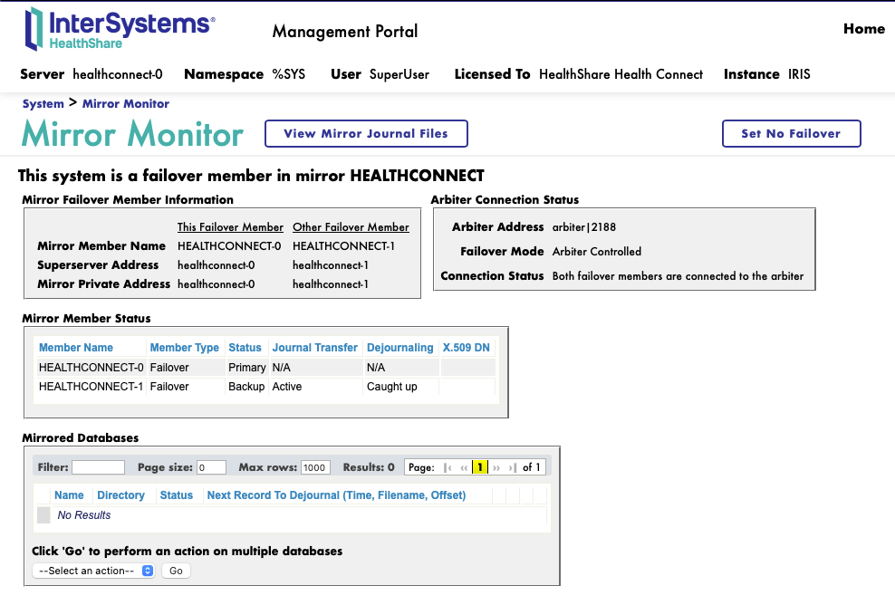

For more information on general CPF merge, see [Automating Configuration of InterSystems IRIS with Configuration Merge](https://docs.intersystems.com/healthconnectlatest/csp/docbook/DocBook.UI.Page.cls?KEY=ACMF).

### Mirror HSSYS

To leverage the automation of mirrored namespaces creation from HealthShare products (including Health Connect) on later stages, we need to mirror **HSSYS** database. See [Configuring Mirroring for Healthcare Products](https://docs.intersystems.com/healthconnectlatest/csp/docbook/DocBook.UI.Page.cls?KEY=GHA_mirror_set_config#GHA_mirror_set_healthcare).

**HSSYS** database comes with all healthcare products and, as of the date of this guide, there is no automated way of mirroring it without having to move database files at the OS level, which requires manual or scripted intervention.

1. Added **HSSYS** to mirror set on the primary node

    Go to [HSSYS Database Properties](http://localhost:8080/csp/sys/mgr/%25CSP.UI.Portal.Database.zen?Dir=%2Fusr%2Firissys%2Fmgr%2Fhssys%2F&DBName=HSSYS) on _System Administration → Configuration → System Configuration → Local Databases → HSSYS_ and click **Add to Mirror HEALTHCONNECT**, after you are done you should see the mirror set assigned to HSSYS (second screenshot).

    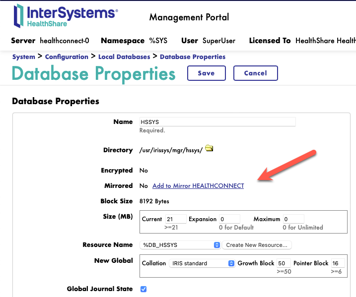

    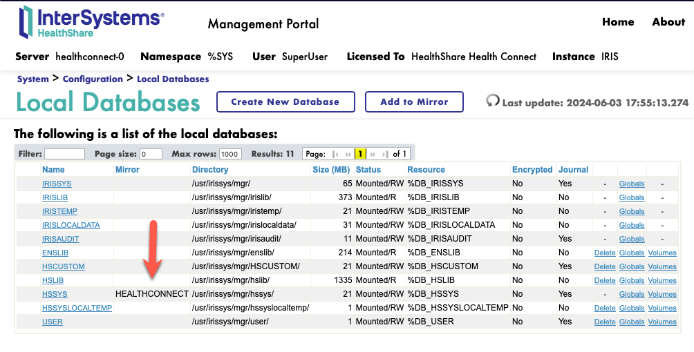

2. Dismount **HSSYS** on the primary node

    Go to [HSSYS Database Details](http://localhost:8080/csp/sys/op/%25CSP.UI.Portal.DatabaseDetails.zen?$ID1=%2Fusr%2Firissys%2Fmgr%2Fhssys%2F&DBName=HSSYS) on _System Operations → Databases → HSSYS_ and click **Dismount**.

    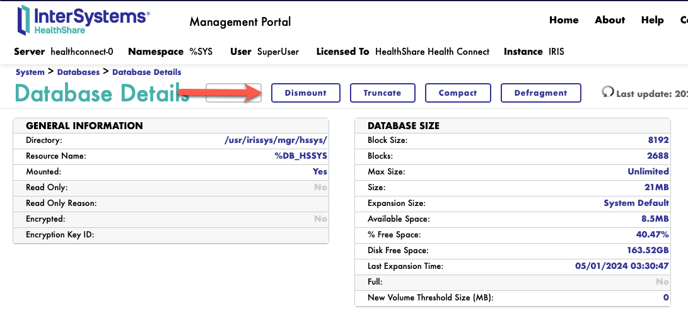

3. Copy **HSSYS.DAT** from the primary node to the backup node

    From your operating system terminal execute the command below to enter the primary node container.

    ```bash
    docker exec -it healthconnect-0 bash
    ```

    The directory `/tmp` is shared between **healthconnect-0** and **healthconnect-1**, so we will copy the file there first

    From the container terminal we just got access to, run the command below to copy the database.

    ```bash
    cp -p /usr/irissys/mgr/hssys/IRIS.DAT /tmp/. && exit
    ```

4. Remount **HSSYS** on the primary node

    Go to [HSSYS Database Details](http://localhost:8080/csp/sys/op/%25CSP.UI.Portal.DatabaseDetails.zen?$ID1=%2Fusr%2Firissys%2Fmgr%2Fhssys%2F&DBName=HSSYS) on _System Operations → Databases → HSSYS_ and click **Mount**.

    

5. Dismount **HSSYS** on the backup node

    Go to [HSSYS Database Details](http://localhost:8084/csp/sys/op/%25CSP.UI.Portal.DatabaseDetails.zen?$ID1=%2Fusr%2Firissys%2Fmgr%2Fhssys%2F&DBName=HSSYS) on _System Operations → Databases → HSSYS_ and click **Dismount**.

    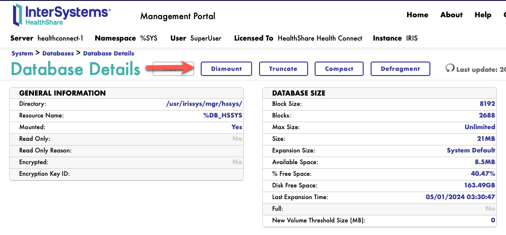

6. Copy the primary **HSSYS.DAT** from the shared directory to the backup node

    From your operating system terminal execute the command below to enter the backup node container.

    ```bash
    docker exec -it healthconnect-1 bash
    ```

    From the container terminal we just got access to, run the command below to copy the database.

    ```bash
    mv /tmp/IRIS.DAT /usr/irissys/mgr/hssys/IRIS.DAT && exit
    ```

7. Remount **HSSYS** on the backup node

    Go to [HSSYS Database Details](http://localhost:8084/csp/sys/op/%25CSP.UI.Portal.DatabaseDetails.zen?$ID1=%2Fusr%2Firissys%2Fmgr%2Fhssys%2F&DBName=HSSYS) on _System Operations → Databases → HSSYS_ and click **Mount**.

    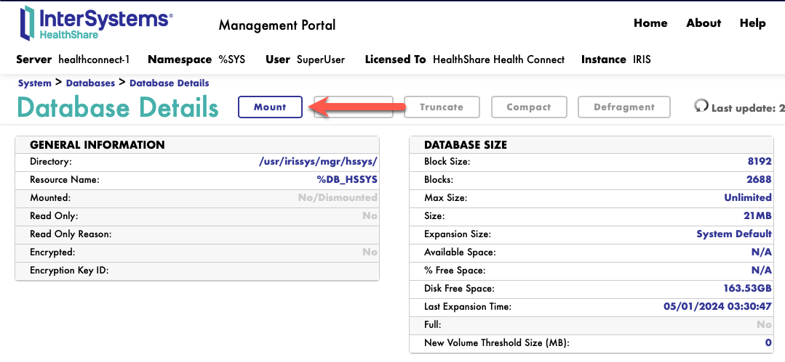

8. Activate & Catchup **HSSYS** on the backup node

    Go to [Mirror Monitor](http://localhost:8084/csp/sys/op/%25CSP.UI.Portal.Mirror.Monitor.zen) on _System Operations → Mirror Monitor_ and click **Activate**. Once is activated click on **Catchup**.

    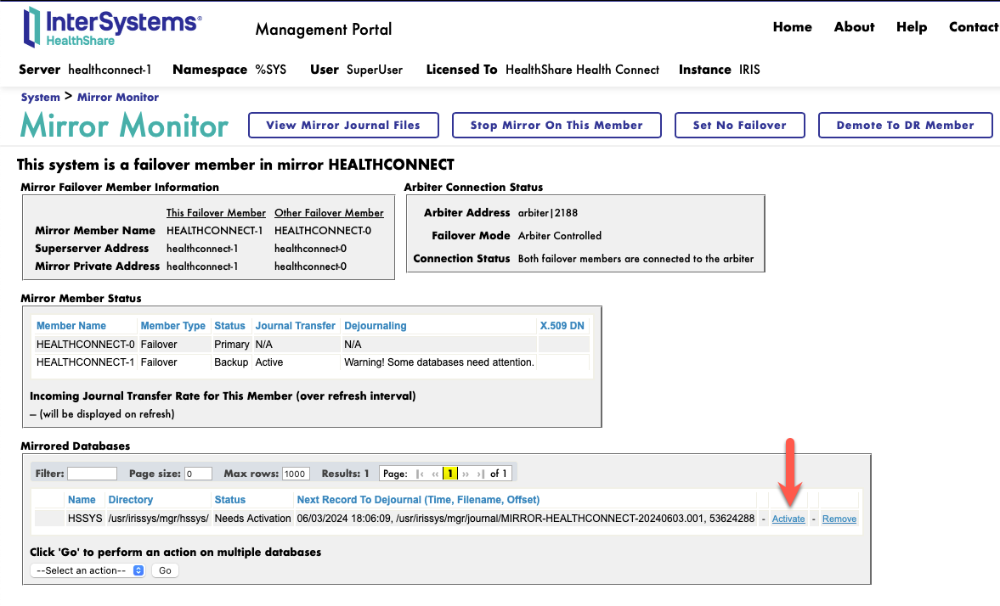

    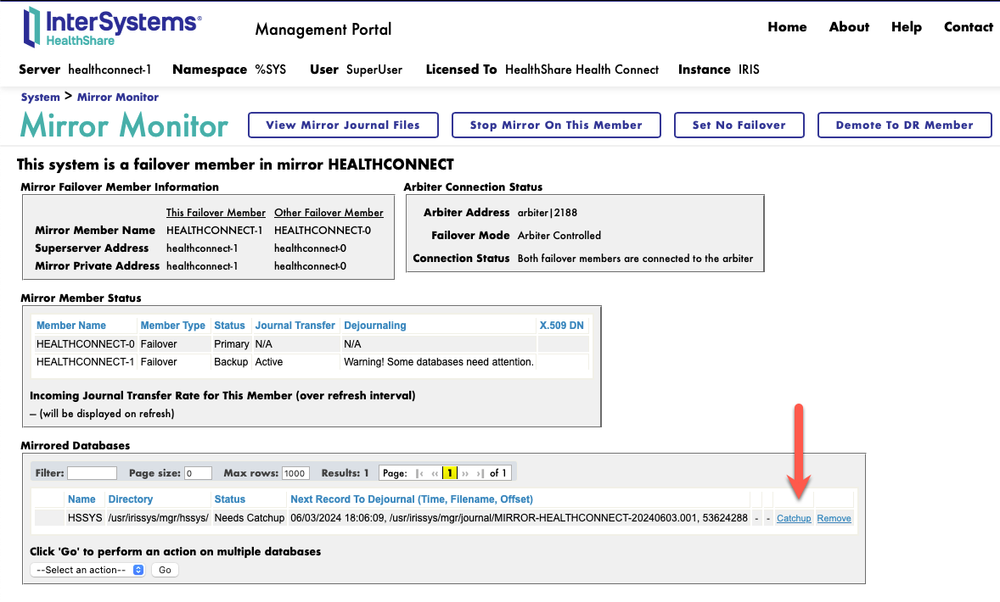

### Network Host Name to VIP or Load Balancer

Still following [Configuring Mirroring for Healthcare Products](https://docs.intersystems.com/healthconnectlatest/csp/docbook/DocBook.UI.Page.cls?KEY=GHA_mirror_set_config#GHA_mirror_set_healthcare), we now need to update Network Host Name to be the **VIP** or the **Load Balancer**, in our case we have a load balancer called **loadbalancer**.

On the primary node, go to the [Installer Wizard](http://localhost:8080/csp/healthshare/HS.HC.UI.Installer.Welcome.cls) on _Health → Installer Wizard_ and click **Configure Network Host Name**. Change the **Network Host Name** value to **loadbalancer** and save.

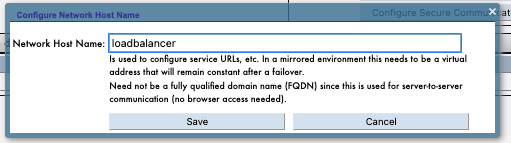

### HS_Services

Make sure that **HS_Services** user is active and has a valid password when creating new namespaces. See [Predefined User Accounts](https://docs.intersystems.com/healthconnect20241/csp/docbook/DocBook.UI.Page.cls?KEY=GSA_config_user_accounts#GSA_config_user_accounts_predefined)

### Activate Mirror Monitor Launch Task

The last step is to activate a task that keeps IRISSYS (which is not mirrored) synced on the backup member. For more, see [Mirroring Considerations for Healthcare Products](https://docs.intersystems.com/healthconnectlatest/csp/docbook/DocBook.UI.Page.cls?KEY=GHA_mirror_manage#GHA_mirror_manage_healthcare).

From your operating system terminal execute the command below to enter the IRIS terminal in the backup node container.

```bash
docker exec -it healthconnect-1 iris terminal iris -U HSLIB
```

Then run the command to configure the task.

```java
do ##class(HS.Util.Mirror.Task).Schedule("HSSYS")
h
```

Once the command above is executed you can see the task in the [Task Schedule](http://localhost:8084/csp/sys/op/%25CSP.UI.Portal.TaskSchedule.zen?$NAMESPACE=%25SYS) of the backup node.

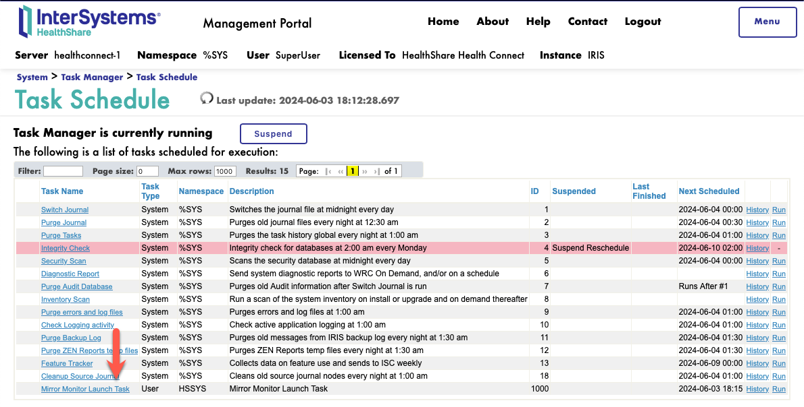

_Give it a couple of minutes for the task to run once is configured._

## Creating a Namespace (AKA: The Cool Stuff)

Now that mirror is configured, we can create namespaces that are automatically mirrored.

### Create a Foundation Namespace on the Primary Node

Go to the [Installer Wizard](http://localhost:8080/csp/healthshare/HS.HC.UI.Installer.Welcome.cls) on _Health → Installer Wizard_ and click **Configure Foundation**. In there, update the **Local Name** to **MIRRORED** and tab out, the rest will be automatically populated. Make sure that **Mirror Database** is **checked** and save.

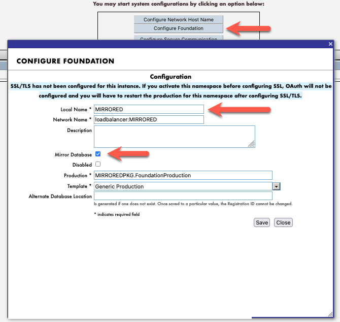

### Activate the Namespace

Still from the [Installer Wizard](http://localhost:8080/csp/healthshare/HS.HC.UI.Installer.Welcome.cls) screen, click in **Activate** for the **MIRRORED** entry that was just created. After the execution is complete, you should see that activation was successful.

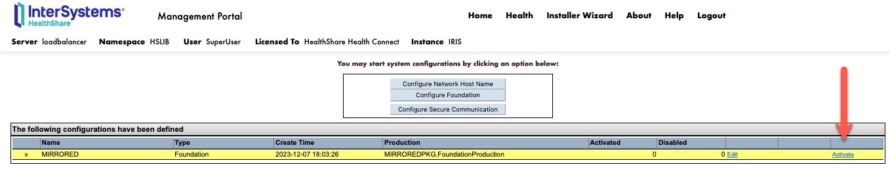

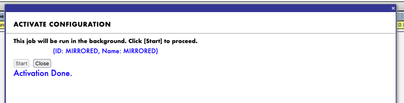

When looking at the backup [Mirror Monitor](http://localhost:8084/csp/sys/op/%25CSP.UI.Portal.Mirror.Monitor.zen) on _System Operations → Mirror Monitor_, you can confirm that the database is configured.

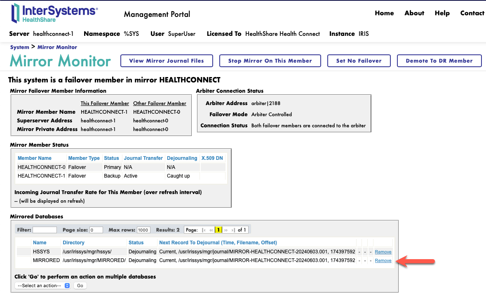

## Optional

Play around with starting a production and failing over to observe the behavior.

To failover, from your operating system terminal execute the command below to enter the primary node container.

```bash
docker exec -it healthconnect-0 bash
```

Then run the command to restart the instance.

```java
iris restart iris
```

You should notice that when accessing the load balanced [SMP](http://localhost:8080/csp/sys/%25CSP.Portal.Home.zen) **healthconnect-1** became the primary and load balancing works fine.

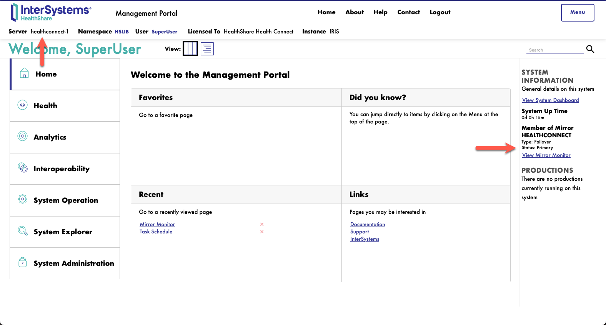

## Bonus

For this container deployment, if you want to have everything configured in a scripted way, update [Custom.Loader.cls](code/healthconnect-user/src/Custom/Loader.cls) by changing `AUTOMIRROR` from **0** to **1**, save and restart your containers (down and up -d again). This will execute the exact same steps above (allow a few minutes for the script to run). To explore the script, see [Custom.AutoMirror.cls](code/healthconnect-user/src/Custom/AutoMirror.cls).

```java
/// Parameter AUTOMIRROR = 0;
Parameter AUTOMIRROR = 1;

...
```
